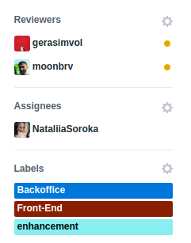
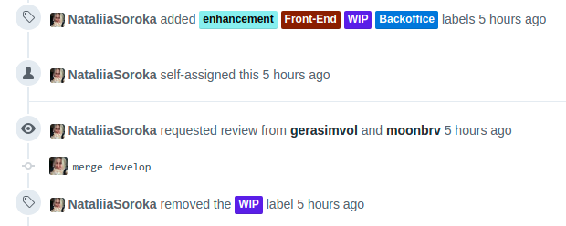

# Git usage

We spend more time to read code that write code. This mean that we need not only easy to read and understad code, but also we should able invetigate history of changes to undestand why our colegues did work in particular way.

In team we need to have good communication for success. So git it is one of our communication tool.

Let's read a quote from [amazing article](https://hackernoon.com/what-makes-a-good-commit-message-995d23687ad)

```
Imagine the following situation: You arrive at the office and there’s a major bug, your company is losing money. You start investigating by using git log --grep and some keywords. You find nothing. Then you use git log -- file/path in a file you think it may be related. You find a commit that look suspicious, but again, the commit message does not tell you why the code is the way it is. You look the author’s name with hope the person is still around, with no luck. Wouldn’t be great if the commit messages helped you? None of this is possible with these messages. As we’ve said, they do not convey any information to the reader. We should avoid them.

It’s important that information live the closest to the codebase as possible since the codebase is the single source of truth. Jira or Github or any separated tool from git are secondary tools. In case they burn on a fire or we switch providers, we still have the git repository. But if all information lives somewhere else that’s not the git repository then we would be in a serious situation. We should then strive to write as much information in commit messages as we can. Those extra minutes of thought to explain to whoever comes next why the changes were made (not the what, since git show will tell you that) will be worth.
```

Here we will discuss several very important topic:
- Learn git
- Instruments
- Branching
- How to write good commit message?
- How to make good PR?

## Learn Git
There are some video courses and articles that will teach you how to use git in the right way:
- [Git In-depth](https://frontendmasters.com/courses/git-in-depth/) (Video Highly-Highly recomended)
- [Practical Git for Everyday Professional Use](https://egghead.io/courses/practical-git-for-everyday-professional-use) (Video)
- [Git tips](https://github.com/git-tips/tips)
- [Git first Aid](http://firstaidgit.ru) (RU)
- [CheatSheet #1](https://www.git-tower.com/blog/git-cheat-sheet/)
- [CheatSheet #2](http://ndpsoftware.com)
- [Learn git branching](https://learngitbranching.js.org/)
- [Pro git Book](https://book.git-scm.com/book/en/v2)
- [Git how to?](https://githowto.com) (nice tutorial for beginners)

## Instruments
There are some desktop clients to use git GUI:
- [GitHub desktop](https://desktop.github.com/) (win, mac)
- [Sourcetree](https://www.sourcetreeapp.com/) (win, mac)
- [GitKraken](https://www.gitkraken.com/git-client) (cross-platform)

## Branching
We use next system that helps us a lot:
- Branch with stable version - master
- Main working branch - develop
- We use two types of branches: feature, bugfix
- Feature and bugfix branches should be make from develop
- Feature branches should have prefix `feature/your-branch-name`
- Bugfix branches should have prefix `bugfix/your-branch-name`
- After end of the sprint we merge `develop` in to `master` and create a release, which will add tag to our stable branch

Main idea was taken from git flow and was adopted to our needs

## Commit message
First of all highly recommend you to read those amazing article that will change you thinking about coomit messages:
- [What makes a good commit message?](https://hackernoon.com/what-makes-a-good-commit-message-995d23687ad)
- [How to Write a Git Commit Message](https://chris.beams.io/posts/git-commit/)

May be you ask yourself: `I never checked commit messages of other people and why do I need follow some rules to show just a message?` If you don't read git commit mesages in you probably didn't work with project that was maintained very long time, or you never fix some code after whole previous tead leave project.

But when you take project to finish it from some one else, history from good commit messages will help you to understand what was done, and may be your collegues already trid solution that you want apply to current feature.

## How to make good PR
**Main goal is make good PR description, so any developer should be able to understand what was done** :+1:

We assume that you usere Jira or some other tool for task treking where you may check ID of card with task.

[Read here how to use Markdown](https://github.com/adam-p/markdown-here/wiki/Markdown-Cheatsheet)

To have good PR that your team mates will understand you should do in the right way next things:
- right branch name
- good PR name
- good PR description
- assign yourself
- add labels
- request review from our colegues

### Right branch name
So you have task from Jira, you should check next thing from your card for branch name:
- Card type in Jira(Task, Bug)
- Card Title
- Card ID

For example you have Card with ID `FE-122`, card type `Task` and title `Create Login form in cms`, in that case you should create branck with name like this:
`feature/FE-122-add-login-form-in-cms`

Lets assume that your colegue take task from Jira with ID `FE-99`, type `Bug`, Title `Fix handling error with status 401`. He should create branch with name `bugfix/FE-99-fix-401-error-handling`

In that case you even don't need go to Jira to read deskription of task.

Lets assume that you see in Jira Bug `FE-231` and Bug `FE-243`, you know that they have same root of problem and when you solve first, second issue will be close automaticaly, name this branch `bugfix/FE-231-FE-243-fix-user-card-size`

Don't make branch name too long, always try to use common sense :wink:

### Good PR name
Good PR name should contain Jira Card ID and title of task:

`FE-122: Create Login form in cms`

That's it... nothing special and magical

### Good PR description
Just shortly deskribe what was done. For example next code will create easy to read description
```
#### Changelog:
- Create login page with form
- Add validation to form
- Add links to forgot password and registration pages
- Show message in modal if login was failed
```
**Result:**
#### Changelog:
- Create login page with form
- Add validation to form
- Add links to forgot password and registration pages
- Show message in modal if login was failed

Nice yeah?

And any person who will review PR will know context of naming in your code, and what to test.

**And last but very important thing...**

<p align="center">
  
</p>

### Assign yourself to PR
When you ask your colegue:

`May you check my PR plz?`

It will be much easy to find it if you will assign yourself and all people will see your avatar in PR list.

### Add labels
Sometime we have BE and FE in one repo, it will be much easy to differenciate PRs if they will have Labels with information about it. No need to write `bugfix` in PR name, if you may just add label `bugfix`

<p align="center">
  
</p>

If you work on big feature and want to ask your colegue to check PR after first implementation, you may add label `WIP` (Work in progress) to avoid situation when some one accident
ly will merge your PR because it work already...

### Request review from our colegues
Instead of asking your colegues to review your PR, you may request review and they will receive notiication on email. You may ask to review several people
